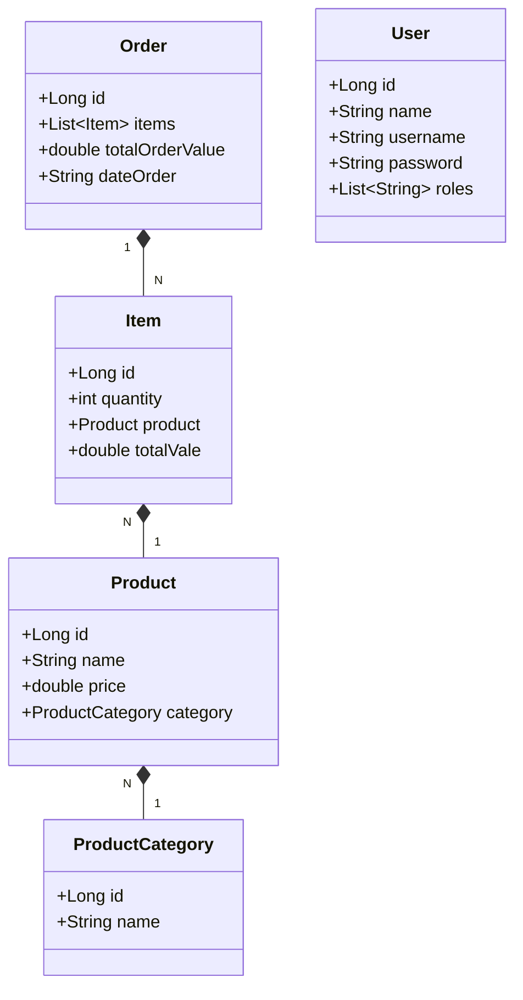

# Isengard Supermarket

Project created for the Santander Bootcamp in partnership with Digital Innovation One

## Technologies Used

- **Java 17**
- **Spring Boot**
- **Spring Security**
- **JPA / Hibernate**
- **MySQL**
- **PostgreSQL**
- **Gradle**
- **Swagger**
- **Railway**

## Project Structure

### Main Packages

- `me.dio.controller`: Contains REST controllers that handle HTTP requests and map them to the appropriate service methods
- `me.dio.controller.config`: Contains configuration classes for Spring Security and other necessary configurations.
- `me.dio.controller.handler`: Contains exception handlers that manage custom error responses for the API.
- `me.dio.doc`: Contains classes related to API documentation, including Swagger configuration.
- `me.dio.domain.dto`: Contains Data Transfer Object (DTO) classes that are used to transfer data between different layers of the application.
- `me.dio.domain.model`: Contains the main entities of the project, representing the database tables.
- `me.dio.domain.repository`: Contains repository interfaces that extend Spring Data JPA repositories for database operations.
- `me.dio.service`:  Contains service interfaces that define the business logic of the application.
- `me.dio.service.impl`: Contains the implementation classes for the service interfaces, providing the actual business logic.

### Entities

- `Item`: Represents an order item.
- `Order`: Represents an order.
- `Product`: Represents a product.
- `ProductCategory`: Represents a product category.
- `User`: Represents a system user.

## Class Diagram


## Development Environment Configuration

To configure the development environment, you need to include the `application-dev.yml` file in your project. 
This file contains the necessary settings for connecting to the local MySQL database and other important configurations. Here is the content of the `application-dev.yml` file:

```yaml
spring:
  datasource:
    url: jdbc:mysql://localhost:3306/isengardinventory
    username: root
    password: your-password
    driver-class-name: com.mysql.cj.jdbc.Driver
  jpa:
    database-platform: org.hibernate.dialect.MySQL8Dialect
    hibernate:
      ddl-auto: update
    show-sql: true
  application:
    name: isengard-inventory
```

To ensure that the application recognizes and uses the application-dev.yml file, you need to set the SPRING_PROFILES_ACTIVE environment variable to dev. You can do this by adding the following configuration in your application settings:

```
SPRING_PROFILES_ACTIVE=dev
```

This configuration activates the development profile, making the application use the settings defined in application-dev.yml.

## Gradle dependencies
Make sure that the `build.gradle`

```gradle
implementation 'org.springframework.boot:spring-boot-starter-data-jpa'
implementation 'org.springframework.boot:spring-boot-starter-web'
implementation group: 'org.springdoc', name: 'springdoc-openapi-starter-webmvc-ui', version: '2.6.0'
implementation group: 'org.springframework.boot', name: 'spring-boot-starter-security', version: '3.3.1'
runtimeOnly 'com.mysql:mysql-connector-j'
runtimeOnly 'org.postgresql:postgresql'
testImplementation 'org.springframework.boot:spring-boot-starter-test'
testRuntimeOnly 'org.junit.platform:junit-platform-launcher'
```

## API documentation
The API documentation can be accessed via Swagger after starting the application:

```bash
http://localhost:8080/swagger-ui.html
```

## Endpoints
### ItemController
- `GET /item` - Return all items
- `GET /item/{id}` - Returns a specific item by ID
- `POST /item` - Insert a new item
- `PUT /item/{id}` - Updates a specific item by ID
- `DELETE /item/{id}` - Deletes a specific item by ID
### OrderController
- `GET /order` - Return all orders
- `GET /order/{id}` - Returns a specific order by ID
- `POST /order` - Insert a new order
- `PUT /order/{id}` - Updates a specific order by ID
- `DELETE /order/{id}` - Deletes a specific order by ID
### ProductController
- `GET /product` - Return all products
- `GET /product/{id}` - Returns a specific product by ID
- `GET /product/getName` - Returns a specific product by name
- `POST /product` - Insert a new product
- `PUT /product/{id}` - Updates a specific product by ID
- `DELETE /product/{id}` - Deletes a specific product by ID
### ProductCategoryController
- `GET /productCategory` - Return all categories
- `GET /productCategory/{id}` - Returns a specific category by ID
- `GET /productCategory/getName` - Returns a specific category by name
- `POST /productCategory` - Insert a new category
- `PUT /productCategory/{id}` - Updates a specific category by ID
- `DELETE /productCategory/{id}` - Deletes a specific category by ID

## Security configuration
The application uses Spring Security for authentication and authorization. The security configuration is done in the `WebSecurityConfig` and `SecurityDatabaseService` classes.

## Exception handling
The project implements a `GlobalExceptionHandler` class to handle global exceptions in the application.

## User initialization
A classe `StartApplication` cria um usuário padrão com senha criptografada ao iniciar a aplicação.

The application will be available at http://localhost:8080.

## Contribution
Contributions are welcome! Feel free to open issues and pull requests for improvements and corrections.
